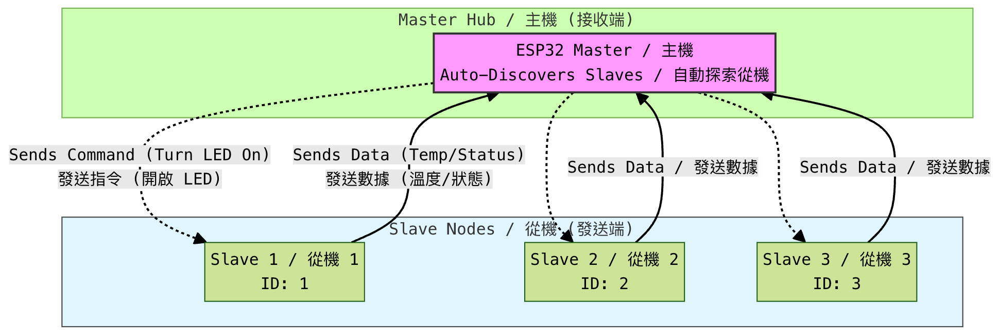
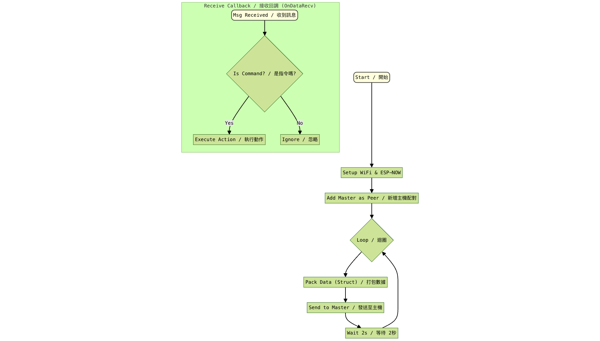

# **ESP-NOW Bi-Directional Network Guide / ESP-NOW 雙向通訊網絡指南**

This document explains the "Many-to-One" framework used in your ESP32 project. This system allows multiple "Slave" devices (sensors, remotes) to talk to a single "Master" device (hub, display), and lets the Master send commands back.

這份文件解釋了您的 ESP32 專案中使用的「多對一 (Many-to-One)」架構。此系統允許這多個「Slave 從機」裝置（如感測器、遙控器）與單個「Master 主機」裝置（如集線器、顯示器）進行通訊，並允許主機發送指令回從機。

## **1\. System Overview Diagram / 系統概覽圖**

Think of this system like a classroom. The Master is the Teacher, and the Slaves are Students.

可以將這個系統想像成一個教室。Master (主機) 是老師，Slaves (從機) 是學生。

* **Students** know who the Teacher is (Hardcoded MAC address).  
  **學生** 知道老師是誰（MAC 位址已寫死在程式碼中）。  
* **The Teacher** doesn't memorize every Student's name beforehand; she learns them when they speak up (Dynamic Pairing).  
  **老師** 不需要預先記住每個學生的名字；當學生發言時，老師會自動認識他們（動態配對）。



## **2\. Core Concepts (Simplified) / 核心概念 (簡化版)**

### **What is ESP-NOW? / 什麼是 ESP-NOW？**

Unlike standard Wi-Fi, ESP-NOW does not need a Router. It is a direct connection between boards, similar to how wireless mice or game controllers work. It is very fast and uses less battery.

與標準 Wi-Fi 不同，ESP-NOW 不需要路由器。它是電路板之間的直接連線，類似於無線滑鼠或遊戲手把的運作方式。它的速度非常快且耗電量更低。

### **The "Envelope" (Struct) / 「信封」 (結構體 Struct)**

Computers can't just send "data"; they need a structure. We use a Struct as an "Envelope." Both the sender and receiver must agree on exactly what fits inside this envelope.

電腦不能隨意發送「數據」；它們需要一個結構。我們使用 Struct (結構體) 作為「信封」。發送方和接收方必須對信封內裝的內容達成一致。

**Your Envelope (struct\_message) contains / 您的信封 (struct\_message) 包含：**

1. **ID:** Who is sending this? (e.g., Robot \#1)  
   **ID:** 誰發送的？（例如：機器人 \#1）  
2. **Type:** What is inside? (Is this Sensor Data? Or a Command?)  
   **Type:** 裡面是什麼？（是感測器數據？還是指令？）  
3. **Value 1 (Float):** Decimal numbers (e.g., Temperature 25.5)  
   **Value 1 (浮點數):** 小數（例如：溫度 25.5）  
4. **Value 2 (Int):** Whole numbers (e.g., Status Code 200 or Milliseconds 5000\)  
   **Value 2 (整數):** 整數（例如：狀態碼 200 或毫秒數 5000）  
5. **Text:** A short note (e.g., "Alert\!" or "OK")  
   **Text:** 簡短筆記（例如："Alert\!" 或 "OK"）

### **MAC Address / MAC 位址**

Every ESP32 has a unique serial number called a MAC Address (e.g., 24:6F:28:A1:B2:C3).

每個 ESP32 都有一個獨一無二的序號，稱為 MAC 位址（例如：24:6F:28:A1:B2:C3）。

* **Slave Logic:** The Slave *must* know the Master's MAC address to send the first message. You write this in the code.  
  **從機邏輯:** 從機 *必須* 知道主機的 MAC 位址才能發送第一條訊息。您需要將其寫在程式碼中。  
* **Master Logic:** The Master is "smart." It reads the "Return Address" on every envelope it gets and saves it. This allows it to reply without you typing in every Slave's MAC address manually.  
  **主機邏輯:** 主機很「聰明」。它會讀取收到的每個信封上的「回信地址」並儲存起來。這讓它能夠回覆訊息，而無需您手動輸入每個從機的 MAC 位址。

## **3\. How the Code Works / 程式碼運作原理**

### **The Slave (Sender) Logic / 從機 (發送端) 邏輯** 

This diagram shows how the Slave initializes, sends data in a loop, and handles incoming commands asynchronously.
此圖顯示從機如何初始化、在迴圈中發送數據，以及非同步處理傳入的指令。



#### **Step 1: Configuration / 設定**

The Slave must have the Master's MAC address hardcoded. It also defines the data structure.

從機必須將主機的 MAC 位址寫死在程式碼中，並定義資料結構。

```
// \[CRITICAL\] Master's MAC Address / 主機的 MAC 位址  
uint8\_t masterMacAddress\[\] \= {0x7C, 0x2C, 0x67, 0x7C, 0x87, 0xFC}; 

// The Data Structure (Envelope) / 資料結構 (信封)  
typedef struct struct\_message {  
  uint8\_t id;  
  MessageType type; // DATA or COMMAND  
  float value1;  
  int value2;  
  char text\[32\];  
} struct\_message;
```

#### **Step 2: Initialization & Pairing / 初始化與配對**

In setup(), the Slave connects to ESP-NOW and registers the Master as a "Peer" (someone it can talk to).

在 setup() 中，從機連線到 ESP-NOW 並將主機註冊為「配對裝置 (Peer)」。

```
// Register the Master / 註冊主機  
esp\_now\_peer\_info\_t peerInfo;  
memcpy(peerInfo.peer\_addr, masterMacAddress, 6);  
peerInfo.channel \= 0;    
peerInfo.encrypt \= false;

if (esp\_now\_add\_peer(\&peerInfo) \!= ESP\_OK){  
  Serial.println("Failed to add peer");  
}
```

#### **Step 3: Sending Data / 發送數據**

In the loop(), the Slave packs the envelope and sends it.

在 loop() 中，從機將資料打包進信封並發送。

```
// 1\. Fill the Envelope / 填寫信封  
outgoingData.id \= 1;           
outgoingData.type \= DATA;      
outgoingData.value1 \= 25.5;  

// 2\. Send to Master / 發送給主機  
esp\_now\_send(masterMacAddress, (uint8\_t \*) \&outgoingData, sizeof(outgoingData));
```

#### **Step 4: Receiving Commands / 接收指令**

If the Master replies, the OnDataRecv function is triggered automatically.

如果主機回覆，OnDataRecv 函式會自動被觸發。

```
void OnDataRecv(const esp\_now\_recv\_info\_t \* info, const uint8\_t \*incomingDataBytes, int len) {  
  // Open the envelope / 打開信封  
  memcpy(\&incomingData, incomingDataBytes, sizeof(incomingData));

  if (incomingData.type \== COMMAND) {  
     // Do something, e.g., Turn on LED / 執行動作，例如開燈  
     Serial.println(incomingData.text);  
  }  
}
```

### **The Master (Hub) Logic / 主機 (集線器) 邏輯**  

This diagram illustrates the "Smart" auto-pairing feature. The Master sits in a wait state until data arrives, then dynamically registers the sender.
此圖說明了「智慧」自動配對功能。主機處於等待狀態，直到數據到達，然後動態註冊發送者。


#### **Step 1: Auto-Pairing (The "Smart" Part) / 自動配對 (智慧功能)**

The Master does **not** have Slave MAC addresses hardcoded. Instead, inside OnDataRecv, it checks if it knows the sender. If not, it adds them immediately.

主機 **沒有** 寫死從機的 MAC 位址。反之，在 OnDataRecv 中，它會檢查是否認識發送者。如果不認識，它會立刻將其新增。

```
void OnDataRecv(const esp\_now\_recv\_info\_t \* info, const uint8\_t \*incomingDataBytes, int len) {  
    
  // 1\. Get Sender's MAC / 取得發送者的 MAC  
  const uint8\_t \* mac \= info-\>src\_addr;

  // 2\. AUTO-PAIRING: Register this sender if new / 自動配對：如果是新裝置則註冊  
  registerPeer(mac); 

  // 3\. Process Data / 處理數據  
  memcpy(\&incomingData, incomingDataBytes, sizeof(incomingData));  
  Serial.print("Slave ID: ");  
  Serial.println(incomingData.id);  
    
  // 4\. (Optional) Reply immediately / (選用) 立即回覆  
  outgoingData.type \= COMMAND;  
  strcpy(outgoingData.text, "ACK");  
  sendToSlave(mac, outgoingData);  
}
```

#### **Step 2: Helper Function \- Register Peer / 輔助函式 \- 註冊配對**

This function ensures the Master creates a connection to the Slave dynamically.

此函式確保主機動態地與從機建立連線。

```
void registerPeer(const uint8\_t \*mac\_addr) {  
  // If we already know them, do nothing / 如果已經認識，什麼都不做  
  if (esp\_now\_is\_peer\_exist(mac\_addr)) {  
    return;   
  }

  // Add new node to peer list / 將新節點加入配對列表  
  esp\_now\_peer\_info\_t peerInfo;  
  memcpy(peerInfo.peer\_addr, mac\_addr, 6);  
  peerInfo.channel \= 0;   
  peerInfo.encrypt \= false;  
  esp\_now\_add\_peer(\&peerInfo);  
}
```

## **4\. Quick Start Guide / 快速入門指南**

1. **Flash the Master / 燒錄主機:** \* Upload master\_hub.ino to your first board.  
   將 master\_hub.ino 上傳到您的第一塊板子。  
   * Open Serial Monitor (115200 baud).  
     打開 序列埠監控視窗 (Serial Monitor) (鮑率 115200)。  
   * **COPY** the address shown: MASTER MAC ADDRESS: XX:XX:XX:XX:XX:XX.  
     **複製** 顯示的位址：MASTER MAC ADDRESS: XX:XX:XX:XX:XX:XX。  
2. **Configure the Slave / 設定從機:** \* Open slave\_node.ino.  
   打開 slave\_node.ino。  
   * Paste the Master's MAC address into line \~18:  
     將主機的 MAC 位址貼上到第 18 行左右：  
     uint8\_t masterMacAddress\[\] \= {0xXX, 0xXX, 0xXX, 0xXX, 0xXX, 0xXX};

   * *Tip: Remember to add 0x before each pair of numbers\!* *提示：記得在每組數字前加上 0x！* 3\. **Flash the Slave / 燒錄從機:** \* Upload the code to your second board.  
     將程式碼上傳到您的第二塊板子。  
3. **Test / 測試:** \* Open the Serial Monitor for the Master. You should see incoming data.  
   打開主機的序列埠監控視窗。您應該會看到傳入的數據。  
   * Open the Serial Monitor for the Slave. You should see "Sent with Success" and potentially "Command Received" if the Master replies.  
     打開從機的序列埠監控視窗。您應該會看到 "Sent with Success"（發送成功），如果主機有回覆，可能還會看到 "Command Received"（收到指令）。
